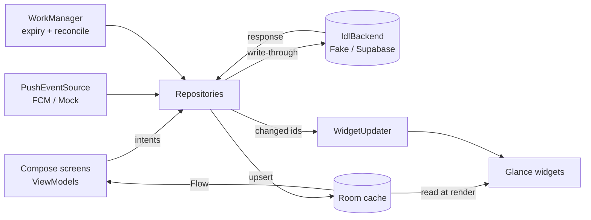

# iDL Architecture

## 1. Shape

Single Gradle module `:app` with a feature-based package layout. A second module is not
worth its build cost yet; the `domain` package has **no Android imports** so it can be
extracted to a pure-Kotlin module later without code changes.

```
app.idl
├── domain/          Pure Kotlin: enums, models, PresenceResolver, PrivacyFilter,
│                    Expiry, AvatarSpec, ReactionRules. 100 % JVM-unit-testable.
├── data/
│   ├── local/       Room (entities, DAOs, IdlDatabase), DataStore prefs
│   ├── remote/      IdlBackend interface + FakeIdlBackend (demo) ; Supabase adapter later
│   ├── push/        PushEvent model, PushEventSource interface, MockPushSource
│   └── repo/        Repositories: Session, Avatar, Presence, Friends, Reactions, Privacy
├── avatar/          AvatarRenderer (Canvas painter of domain AvatarSpec layers),
│                    Compose AvatarImage
├── widget/          Glance widgets (Solo friend, Your iDL), WidgetUpdater, config activity
├── work/            WorkManager: ExpiryWorker, ReconcileWorker
├── notify/          Notification channels + publisher
├── ui/              Compose screens per feature (onboarding, home, status, friend,
│                    avatar, invite, privacy, widgets, debug) + theme
└── AppContainer     Manual DI: one object graph created in IdlApp
```

**Why manual DI:** the graph has ~10 singletons. Hilt would add annotation processing,
Gradle plugins and onboarding cost with no testability gain over constructor injection.

## 2. Data flow



Rules:

* **Room is the single display source of truth.** UI and widgets never read the network.
* Writes go backend-first (server enforces auth/privacy), then cache. If the backend call fails
  for the user's *own* status, the local state is still saved with `pendingSync = true` and
  `ReconcileWorker` retries with exponential backoff.
* Friend data arrives already **filtered by the server** (`PresenceView`). The client never
  receives fields it is not allowed to see, so there is nothing to hide client-side.

## 3. Presence resolution

`PresenceResolver.resolve(states, now, sourceSettings)` → `ResolvedPresence`:

1. Drop expired states (`expiresAt <= now`) and disabled sources.
2. If any surviving state is `isInvisible`, return `ResolvedPresence.Invisible`
   (owner sees it locally; nothing is published).
3. Per field, pick the value from the highest-priority state that sets it.
   Manual (100) > VRCQ (80) > desktop (70) > verified external (60) > android local (40) > inferred (10).
4. Mood / availability / intent / note are **manual-only by default**: automated sources can
   only contribute `activity` and visual hints unless the user opts in.
5. No surviving state → `ResolvedPresence.Idle` (neutral avatar, "no status").

Ties are broken by most recent `updatedAt`, then by source enum ordinal — fully deterministic.

## 4. Expiration

* Every `PresenceState` has a non-null `expiresAt` (max 7 days; default 4 h).
* Expiry is evaluated **at read/render time** using an injected `Clock` — the UI and widgets
  are correct even if no job runs.
* `ExpiryWorker` is scheduled (one-time, unique) for the next `expiresAt` across own + cached
  friend states, to refresh widgets and purge rows. Server side, a cron deletes expired rows
  and read endpoints filter `expires_at > now()`.

## 5. Cache & reconciliation

| Trigger | Action |
| --- | --- |
| Push event `presence_changed(userId)` | fetch `/presence/friends/{id}` → upsert → update widgets showing that id |
| Push `reaction_received` | fetch inbox → upsert → notify |
| App foreground | full reconcile (friends + presence + inbox) |
| `ReconcileWorker` periodic (6 h, network-constrained) | full reconcile, fills missed pushes |
| Widget update failure | widget keeps last image, shows "updated Xh ago" stale hint |

Staleness: each cached friend row stores `fetchedAt`. Widgets show a subtle stale marker when
`now - fetchedAt > 2 h` **and** the last reconcile failed.

## 6. Error / retry

* Network errors map to `IdlError` (`Offline`, `Unauthorized`, `NotFound`, `Forbidden`,
  `RateLimited`, `Server`, `Unknown`). Repos return `Result<T>`; ViewModels render inline
  error rows, never crash.
* Retries: WorkManager exponential backoff (30 s base) for writes and reconcile. No tight loops,
  no polling of external services.

## 7. Observability

* `IdlLog` wrapper over `android.util.Log` with stable event names
  (`presence.set`, `widget.render`, `widget.render_failed`, `reconcile.ok/failed`).
  Never logs note text or friend usernames at INFO.
* Crash reporting: interface placeholder (`CrashReporter`); Firebase Crashlytics or Sentry to be
  chosen with the backend (see DECISIONS D-07).

## 8. Feature flags

`FeatureFlags` (compile-time defaults, overridable from Debug screen via DataStore):

| Flag | Default |
| --- | --- |
| `circles` | off (v0.5) |
| `integrations.discord` / `steam` / `xbox` / `vrcq` / `desktopBridge` / `sdk` | off |
| `deepLinks` | off |
| `mockPush` | on in debug |
| `remoteBackend` | off (fake backend) |
