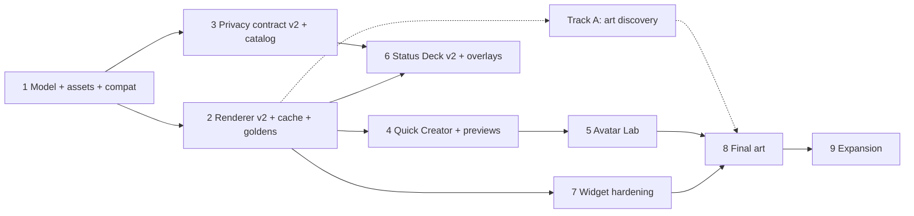

# iDL Avatar Creator — Implementation Plan

Plan for implementing [`IDL_AVATAR_CREATOR_MASTER_PLAN.md`](IDL_AVATAR_CREATOR_MASTER_PLAN.md)
(the "master plan", §n references below) on top of the existing codebase (branch
`milestone-1-supabase`, commit `52c95aa`).

---

## 1. Review summary

The master plan fits the existing architecture: a deterministic 2D layered renderer, widget-first
legibility, persistent identity separate from temporary presence, privacy applied before
composition, and no 3D. About a third of it already exists in an early form. The rest falls
into four kinds of work:

1. **A data-model change.** The enum-based `AvatarConfig` becomes asset-ID-based
   (`AvatarConfiguration` + `StyleDna`, §12). That touches the client, the server, and the golden
   vectors.
2. **An asset system that doesn't exist yet**: manifests, a registry, compatibility, fallbacks,
   anchors (§10–11).
3. **Renderer v2**: render targets, size-based simplification, a render-key cache, brows,
   high-contrast and wallpaper-contrast modes (§13).
4. **New UX**: Quick Creator, Avatar Lab, widget-context previews, editable Status Deck presets
   (§8–9).

Artwork (§15, Phase A) is a dependency that engineering can't supply. The plan therefore keeps
the procedural vector painter as a **placeholder asset pack** behind the same asset interface, so
every engineering phase can ship and be tested before final art exists.

### 1.1 What already exists

| Master plan | Current implementation | Gap |
| --- | --- | --- |
| Identity vs temporary expression/context (§4) | `AvatarConfig` (identity) + `PresenceState.visual` + `AvatarComposer` | No `StyleDna`, no per-user semantic overrides |
| Deterministic layered renderer (§13) | `AvatarSpec.plan()` (pure) + `AvatarRenderer` (Canvas), used in app and widgets | No targets/variants, no brow layer, no anchors per base, no cache |
| Expression vocabulary (§6.2, §16.2) | 15 expressions → `FaceSpec(eyes, mouth, extra)`, all visually distinct (tested) | Brows missing; eye/mouth families not user-selectable |
| Bases (§5) | 9 procedural bases: human, blob, robot, ghost, cat, fox, bear, alien, pixel | MVP set is blob, bot, ghost, critter, **orb**; needs a mapping |
| Size simplification (§13.4) | Thresholds at 48/64/96 px in `AvatarSpec` | Not keyed to render targets; widgets always render 256 px |
| Availability cue (§14.3) | Colored dot | **Color-only, which is prohibited.** Needs a shape glyph per state |
| Activity badge (§3.2) | System emoji drawn on canvas | Emoji is "prototype only"; needs owned glyphs |
| Privacy before composition (§18, Warning 4) | Server composes the avatar; derived-leak rule; 29 golden vectors | Breaks once composition depends on client-side asset packs (D-24 below) |
| Status Deck (§9) | 7 quick states, custom composer, expiry, Invisible | Presets not editable; 3 of the 10 preset definitions are missing; no per-status audience; no QS tile/shortcuts |
| Widget preview (§8.3) | None in the editor | Mandatory per the master plan |
| Accessibility (§14.3) | Content descriptions, radio roles | No state descriptions for swatches, no high-contrast render, no reduced motion |
| Tests (§23) | 78 JVM + 8 instrumented; bitmap distinctness test | No snapshot/golden-image regression |

### 1.2 Issues in the master plan to resolve

1. **Server composition vs. client asset packs (biggest decision).** Compatibility rules,
   fallbacks and per-user `semanticVisualOverrides` live in versioned asset packs. Re-implementing
   them in SQL (as `compose_avatar` does today) would duplicate the whole engine. **Proposal
   (D-24):** the server filters *semantic* state only. It returns the persistent configuration
   (or a minimal one) plus only the presence fields the viewer may see, and the client composes
   from that filtered input. Privacy still comes before composition (Warning 4), because the
   client never receives hidden fields. Overrides keyed by a hidden state (e.g. `sleepy → tea`)
   can't fire because the key isn't present. The golden vectors move from "composed avatar" to
   "filtered semantic view", and a second Kotlin-only vector suite covers composition.
2. **Saved avatars must survive the model change** (§10.5 rule 1). `human`, `alien`, `pixel`,
   `cat`/`fox`/`bear` need explicit fallback mappings: cat/fox/bear become critter variants;
   human, alien and pixel are kept as a *legacy* pack, or mapped (decision needed, §6 Q2).
3. **Internal inconsistencies:**
   - §16.1 says "6 Status Deck presets" but §9.3 lists 10.
   - §16.2 has 10 MVP expressions, but the art brief (§25) requires 15 visual states and the
     app already ships 15.
   - §13.1/§14.3 contain unresolved `[web:NN]` citation placeholders.
   - The plan below assumes 10 presets and keeps all 15 expressions.
4. **Per-status audience selector (§9.2).** There's no per-status audience today; rules are
   per category. It needs a server change (an audience on `presence_states`), and it multiplies
   the privacy surface. I'd defer it past the creator MVP.
5. **Wallpaper contrast modes (§12.3).** These are implementable: `WallpaperManager.getWallpaperColors()`
   (API 27+, so an API-26 fallback is needed) exposes `HINT_SUPPORTS_DARK_TEXT`. It needs no extra
   permission, but launchers vary, so it needs a manual override.
6. **Entitlements (§10.5 rule 4, §17)** need a server catalog of valid asset IDs regardless of
   monetization. Today `put_avatar` validates only `baseForm`; with asset IDs, unknown IDs must be
   rejected server-side. Paid tiers can stay off until monetization is decided.
7. **Snapshot testing (§23)** needs a tool. The renderer uses `android.graphics`, so the options
   are Roborazzi with Robolectric native graphics (runs on the JVM, works in CI) or committed
   golden PNGs compared on a device. These are new dependencies and need sign-off (§6 Q4).

---

## 2. Architecture decisions to add to IDL_DECISIONS.md

- **D-24 · Server filters semantics; client composes visuals.** Changes the `PresenceView`
  contract (below), `presence_view()` SQL, and the golden vectors. Removes `compose_avatar` from
  SQL.
- **D-25 · Asset packs are data plus code.** A pack is a JSON manifest. Assets are either
  `raster` (WebP layers, for final art) or `procedural` (a named painter in `AvatarRenderer`, for
  placeholder art). Both pass through the same anchors, z-order, compatibility and fallback
  logic, which is what lets art arrive late without blocking engineering.
- **D-26 · Packs ship in the APK** for the MVP (`assets/packs/<packId>/v<n>/`). Remote pack
  delivery (Play Asset Delivery or CDN) waits until monetization.
- **D-27 · Render cache:** a memory LRU (about 8 MB) plus a disk cache under `cacheDir/renders`,
  keyed by SHA-256 render key (§12.5). Renders contain only filtered state, and files live in
  app-private cache, never at URLs (§10.5 rule 6, §18.5).
- **D-28 · Availability is shape *and* color.** Each availability state gets a distinct glyph
  silhouette (e.g. text_only = speech bubble, do_not_disturb = crescent, afk = clock), which
  satisfies §14.3 and §7.2.

### Proposed `PresenceView` v2 (wire format)

```json
{
  "userId": "…",
  "identity": { "...AvatarConfiguration, or its minimal form when avatar is hidden..." },
  "mood": "sleepy", "availability": "text_only", "intent": null,
  "activityType": "vr", "activityLabel": null, "joinable": null, "joinUrl": null,
  "note": null,
  "visual": { "props": ["tea"], "scene": "rainy_window", "headAccessory": null, "expression": null },
  "updatedAt": "…", "expiresAt": "…"
}
```

`visual` is present only when `avatar` is visible. `visual.expression` is present only when
`mood` is visible (the derived-leak rule, now on the server at the field level). The client
resolves everything else.

---

## 3. Phases

Each phase ends with a runnable app, all tests green, rendered target-size output reviewed by eye
(§26.11), and a checkpoint report. Sizes: **S** ≈ 1–2 days, **M** ≈ 3–5 days, **L** ≈ 1–2 weeks
of focused engineering.

### Track A (parallel, owned by you and artists) — Visual discovery

The master plan's Phase A: mood boards, three prototype systems, user tests, art-direction lock.
Engineering supports it with:

- **A-tools (S, in Phase 2):** a `RenderSheet` generator that exports every
  base × expression × target × wallpaper combination as one PNG contact sheet. Use it to compare
  candidate art systems at real widget sizes.
- **A-drop (Phase 8):** a manifest validator plus a QA sheet for incoming art.

Engineering phases 1–7 don't block on Track A.

---

### Phase 1 — Avatar model v2, asset registry, compatibility engine (L)

**Goal:** the §12 data model and the §10–11 asset/compatibility logic as pure Kotlin, with the
current art re-expressed as a procedural pack.

Deliverables:

- `domain/avatar/`: `AvatarConfiguration` (asset-ID based, §12.1), `StyleDna` (§12.2),
  `IdentitySlot` (schema only, single active slot, §8.5), `RenderTarget`, `AvatarRenderRequest`.
- `domain/asset/`:
  - `AssetManifest` / `AssetDef`: every §10.3 field (slot, z-index, anchor, compatible bases,
    conflicts, requires, occlusion, `widgetSafe`, simplification variant, accessibility label,
    tier, license).
  - `AssetRegistry`: multi-pack, versioned.
  - `CompatibilityEngine`: conflict, require and fallback evaluation, plus the §11.3 priority
    order.
  - `AvatarResolver`: the §11.2 ten-step algorithm, minus rendering, producing a `ResolvedAvatar`
    layer list.
- `assets/packs/core_proto/v1/manifest.json`: the current 15 expressions, accessories, props and
  scenes, plus bases mapped to the MVP five (blob, bot, ghost, critter with ear/feature variants
  covering cat/fox/bear, and a new **orb**), all as `procedural` assets.
- Migration `AvatarConfig` (v1 enums) → `AvatarConfiguration` (v2 IDs), with an explicit fallback
  table. Room schema v2 with a real migration (no destructive fallback).
- Semantic mapping tables: mood → expression, availability → indicator glyph, activity → badge,
  and intent → motif (§7.2, e.g. `want_company` → open hand), all data-driven from the manifest.

Tests (§23 unit): compatibility, conflicts, required dependencies, per-base fallback, expression
mapping per base, pack-version fallback, v1→v2 migration for every v1 enum value, and resolver
determinism.

Exit: the app behaves as today, but on v2 configs. Existing Avatar Studio edits v2 through an
adapter.

### Phase 2 — Renderer v2, targets, cache, visual regression (L)

**Goal:** the §13 rendering architecture.

Deliverables:

- `AvatarRenderer` consumes `ResolvedAvatar` layers in §13.2 order. It adds:
  - a **brow layer**;
  - per-base **anchor maps** (face-safe zone, eye/brow/mouth/head/face/prop anchors, §15.2);
  - **occlusion masks** (e.g. a VR headset hides eyes, so an eye-only expression variant is used).
- **Render targets** (§12.4) with the §13.4 simplification table: compact 48, tile 64,
  standard 96, large 128, profile 256, share 512.
- **Availability glyphs** (D-28) and owned **activity badge glyphs**, replacing system emoji.
- **High-contrast mode** and **wallpaper contrast modes** (light/dark sticker outline and halo).
- `RenderCache` (D-27) with render-key invalidation on pack version, configuration, presence,
  target, size, contrast mode or renderer version.
- **Visual regression:** Roborazzi with Robolectric native graphics (pending Q4) covering every
  base × core expression × compact/standard/large × light/dark/high-contrast, plus every preset.
- The `RenderSheet` contact-sheet exporter for Track A.
- A legibility lint for packs: automated contrast check between face and scene at 48 px, and
  "face-readability" checks at compact size.

Exit: a 48×48 render shows an identifiable base, an expression and a **non-color-only**
availability cue (acceptance criteria 5–6). Golden images are committed and reviewed.

### Phase 3 — Privacy contract v2 and server asset catalog (M)

**Goal:** D-24, and make the server aware of valid asset IDs.

Deliverables:

- SQL migration `…_avatar_v2.sql`:
  - `avatar_configurations.config` becomes the v2 shape;
  - `presence_view()` returns the v2 `PresenceView` (field-level filtering only, `compose_avatar`
    removed);
  - an `asset_catalog` table (packId, version, assetId, tier, `widgetSafe`), loaded from the
    manifest by a generated seed migration.
- `put_avatar` rejects unknown, retired or non-entitled asset IDs. Entitlement check is
  **free-tier only** for now (§17.1).
- Golden vectors v2:
  - `contract/privacy_vectors.json` now pins the filtered *semantic* view;
  - a new Kotlin-only `contract/composition_vectors.json` pins (filtered view + pack) →
    resolved layers.
- Client: `SupabaseIdlBackend` and the fake backend move to v2. Cached v1 `PresenceView` rows are
  migrated or refetched.
- A mutation check, as before: deliberately leak a field and confirm the vectors fail.

Exit: the SQL suite, the Kotlin vector tests and `SupabaseRestIT` all pass. Hidden mood can't
influence expression, props or scene in any rendered output, verified by a composition-vector
case for each `semanticVisualOverride`.

### Phase 4 — Quick Creator and widget preview strip (M)

**Goal:** first-run creation in under two minutes (§8.1–8.3), with mandatory widget previews.

Deliverables:

- Quick Creator: base → vibe (10 style families, which seed `StyleDna`) → palette (12 curated
  families with contrast checks) → signature accessory (recommended for base and vibe) → status
  preview (neutral, sleepy, busy, VR, happy) → widget preview → save. It replaces the current
  first-run Avatar Studio.
- `WidgetPreviewStrip`: 48/64/96/128 px, circle context, dark/bright wallpaper simulation and
  high-contrast. Contrast feedback in specific wording (§8.3 examples), driven by the Phase 2
  legibility lint.
- Accessibility: names and state descriptions for every asset tile and swatch (color names), a
  coherent TalkBack order, and testing at 200% font size.
- Analytics events: creation started/completed, time to first save, signature set. Counts only,
  per the product spec's privacy rules.

Tests: Quick Creator completion UI test (target under 2 minutes, timed in the test), plus
accessibility checks (`ComposeTestRule` semantics assertions).

Exit: acceptance criteria 1, 2, 3 (signature persists), 12 and 13.

### Phase 5 — Avatar Lab (M–L)

**Goal:** the deep editor (§8.1, §8.4) with adaptive layout (§14.4).

Deliverables:

- Categories: Identity, Face (eye/mouth families), Colors, Wearables, Props, Scenes, Frames,
  Saved looks, Preview modes, Accessibility.
- Undo/redo (a command stack over `AvatarConfiguration`), randomize category, "Surprise me"
  constrained by the `CompatibilityEngine`, "Keep identity, change vibe", favorites, recents,
  named saved looks (stored as `IdentitySlot` rows, one active), and copy-and-edit.
- Search/filter by collection, palette, type, owned/free, mood.
- Adaptive layouts: compact (bottom-sheet picker), medium (two pane), expanded (rail + grid +
  multi-context preview). This needs the `material3-adaptive` dependency (Q4).

Tests: category switching, save/load, the randomized result is always valid (property test: 1,000
seeds with zero conflicts), and undo/redo invariants.

Exit: acceptance criterion 7 (incompatible combinations blocked or resolved predictably).

### Phase 6 — Presence integration and Status Deck v2 (M)

**Goal:** the master plan's Phase D on top of the new model.

Deliverables:

- Status Deck presets aligned to §9.3 (all 10), **editable and saveable**. Presets change
  presence and temporary context only; they never mutate identity (§9.2).
- `StyleDna.semanticVisualOverrides` editor: "When I'm sleepy, show tea + blanket".
- Entry points: Quick Settings tile (opens the deck or applies the last preset), launcher
  shortcuts for the top 3 presets, a notification action ("Set status"), and an own-widget tap
  (already exists).
- Reactions as temporary overlays on the recipient's avatar (§6.2, Phase D), dropped first at
  compact sizes.
- Signature accessory persists through status changes where compatible (e.g. glasses survive
  "sick"; a VR headset uses the visor-compatible glasses variant).

Tests: preset → presence mapping, identity unchanged after every preset, override application
only for visible semantic keys, and expiry reverting the render (acceptance criteria 4, 8, 9).

### Phase 7 — Widget hardening (M)

**Goal:** the master plan's Phase E.

Deliverables:

- Size-aware widget rendering: Glance `LocalSize` → `RenderTarget`, replacing the fixed 256 px.
- Wallpaper contrast from `WallpaperColors` (API 27+), with a manual setting and a fallback on
  API 26.
- Render cache pre-warm after friend updates, constrained to charging or unmetered work.
- Offline last-known output from cache; a stale marker outside the art (already exists).
- Circle-widget compact context, prepared for v0.5 group widgets.
- Launcher QA matrix: Pixel Launcher, One UI, Nova, at 1×1/2×2/4×2, light/dark, large font.
  Needs physical devices or Firebase Test Lab.

Exit: acceptance criteria 5, 10, 11 on real launchers; refresh-success and render-error metrics
logged.

### Phase 8 — Final art integration (L, gated on Track A)

**Goal:** replace placeholder procedural assets with the approved art direction.

Deliverables:

- `core_launch` pack v1 (§16.1 inventory: 5 bases, 12 palettes, 15 expressions, 12 accessories,
  10 props, 6 scenes, 4 frames, 8 reaction overlays) as raster WebP layers with full metadata.
- Pack validator CLI (Gradle task): anchors in bounds, every compatible base rendered, conflicts
  declared on both sides, accessibility labels present, license fields present, widget-safe
  variants for compact.
- The QA sheet for every new asset (§15.3), reviewed by a human before merge.
- Fallback mapping `core_proto` → `core_launch`, so no saved avatar breaks.

Exit: all visual regression goldens re-approved on final art; acceptance criterion 14.

### Phase 9 — Expansion (post-MVP, each item independently gated)

Each item needs its own spec before work starts:

- Multiple identity slots.
- Duo and circle shared scenes (with v0.5 circles).
- Expansion bases (§5.2).
- Vibe suggestions (§19): start with on-device keyword matching to catalog tags; an LLM provider
  only with a privacy review.
- VRCQ visual hints: already normalized in `EnvelopeNormalizer`.
- Per-status audience selector (§1.2 item 4).
- Entitlements and paid packs (§17.2), only after moderation and licensing exist.
- Creator packs: blocked on moderation (§18.8).

---

## 4. Sequencing and dependencies



Critical path: 1 → 2 → 4 → 5 → 8. Phases 3, 6 and 7 can run in parallel after Phase 2. The
Milestone 1 backend work (FCM, real Supabase project) is independent, but Phase 3 should land
before the closed alpha so the server contract only changes once with real users.

## 5. Master-plan acceptance criteria → phase

| # (§22) | Phase |
| --- | --- |
| 1 under-2-minute creation | 4 |
| 2 deterministic config | 1 (already true; preserved through migration) |
| 3 signature accessory persists | 4, 6 |
| 4 Status Deck without Lab | 6 (largely exists) |
| 5 all render targets | 2, 7 |
| 6 48 px legibility | 2 (lint + goldens), 8 (final art) |
| 7 incompatibilities resolved | 1, 5 |
| 8 manual overrides automation | exists (`PresenceResolver`), re-verified in 6 |
| 9 expiry reverts render | exists, re-verified in 6 |
| 10 privacy-filtered renders | 3 |
| 11 offline last-known output | exists, cache-backed in 7 |
| 12 accessible labels/states | 4, 5 |
| 13 dark mode + large font | 4, 5 |
| 14 snapshot coverage | 2, 8 |
| 15 renderer/conflict unit tests | 1, 2 |

## 6. Decisions (answered 2026-10-03)

1. **Art:** placeholder (procedural) art until the idea is validated. Phase 8 waits on that.
2. **Legacy bases:** fold into the five MVP bases:
   - human → orb
   - alien → blob + antennae
   - pixel → bot + pixel eye family + pixel frame
   - cat/fox/bear → critter + ears feature (fox also gets a muzzle)
   - robot → bot; blob and ghost unchanged
3. **D-24 adopted:** the server filters semantics and the client composes.
4. **New dependencies approved:** Roborazzi + Robolectric (snapshot tests) and
   `androidx.compose.material3.adaptive`.
5. **Status Deck:** all 10 presets from §9.3; per-status audience deferred to Phase 9.

## 7. Phase 1 scope adjustment

Phase 1 is wired into the widget path. `WidgetRenderInputs` migrates the saved avatar, or a
friend's `restingAvatar`, and `AvatarResolver` chooses the layers the widget draws. Room and the
server still store the v1 `AvatarConfig`. Storage, the wire format and the server switch to
`AvatarConfiguration` together in Phase 3, so persisted data changes exactly once.

Phase 1 task spec for implementers: [`handoff/PHASE_1_TASK.md`](handoff/PHASE_1_TASK.md).
