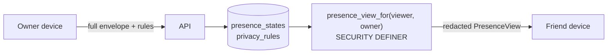

# iDL Privacy Model

## 1. Enforcement boundary



* **The server is the only enforcement point.** A viewer's client receives a `PresenceView`
  whose disallowed fields are *absent*, not flagged. Client-side code must never be the reason
  a field is hidden.
* The same pure function (`PrivacyFilter.viewFor`) runs on the client for (a) the fake backend
  in alpha and (b) "Preview as <friend>" in the Privacy Center. Its unit tests are the
  reference behaviour the SQL function must match (golden test vectors shared in v0.2).

## 2. Categories & default audiences

| Category | Covers | Default |
| --- | --- | --- |
| `avatar` | avatar appearance (base, expression, props, scene) | friends |
| `availability` | available / text_only / busy … | friends |
| `last_updated` | timestamps | friends |
| `mood` | mood | close_friends |
| `intent` | invite_me / want_company … | close_friends |
| `activity_category` | activity type (gaming, vr…) | close_friends |
| `activity_name` | label ("VRChat") | only_me |
| `joinable` | joinable flag + join URL | only_me |
| `status_note` | free-text note | close_friends |
| `external_links` | linked accounts | only_me |

Defaults match principle "accepted friends see basic avatar and broad availability only".
When `avatar` is hidden, viewers get the owner's **neutral base avatar** (base form + color),
never the live expression — so expression can't leak mood.

`expression` is part of `avatar` but **if `mood` is hidden from a viewer, the expression is
replaced by the owner's resting expression** (the derived-leak rule) — so the face can't reveal
a hidden mood.

`expiresAt` is returned whenever any status field (or a status-driven avatar change) is
visible, together with a `restingAvatar`. Clients need both to revert a cached state at expiry
while offline. `updatedAt` is still governed by `last_updated`.

## 3. Audience evaluation (`PrivacyFilter.allows`)

```
allows(category, viewer, owner):
  if viewer == owner                          -> true
  if blocked(owner, viewer) or blocked(viewer, owner) -> false   # nothing at all is returned
  if not friends(owner, viewer)               -> false
  rule = rules[category] ?: default(category)
  nobody | only_me  -> false
  friends           -> true
  close_friends     -> viewer in owner.closeFriends
  circles           -> viewer in any(owner.circles[rule.ids])     # v0.5
  individuals       -> viewer in rule.ids
```

## 4. Invisible mode

* Invisible is a **user-level toggle** (not part of an expiring state, see D-16). When on,
  `presence_view_for` returns **only** the owner's resting avatar with no status fields and no
  timestamps — byte-for-byte identical to "no status set" (unit-tested).
* Toggling Invisible sends friends the same ids-only `presence_changed` push as clearing a
  status, so their widgets drop the status promptly but can't tell invisibility from a clear.
* The owner still sees their full status locally and in the "Your iDL" widget.

## 5. Revocation

| Event | Effect (same transaction) |
| --- | --- |
| Friend removed | friendship row deleted → `presence_view_for` returns nothing; push `friend_removed` tells the viewer client to purge cache and widgets show "no longer connected" |
| Block | as above + both directions denied + pending reactions/invites deleted |
| Integration revoked | `integration_consents.revoked_at` set, that source's `presence_states` deleted |
| Account deletion | cascade deletes; devices removed |

Client: on any 403/404 for a friend, or `friend_removed` push, delete that friend's rows from
`friends`, `friend_presence`, `avatars`, and re-render widgets subscribed to them.

## 6. Data minimisation

* No location, no contacts upload (contact invite = OS share sheet with link).
* Avatar images are **rendered on device** from config; no public image URLs exist.
* Analytics events carry no note text, no avatar config, no friend ids — only counts and enums.
* Notes are limited to 80 chars and expire with their state.
