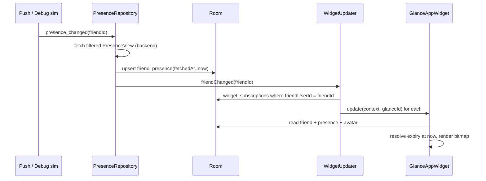

# iDL Widget Architecture

## 1. Technology

* **Jetpack Glance 1.1** (`GlanceAppWidget`) for layout, click actions and sizing.
* The avatar is **not** composed from Glance primitives. It is painted by `AvatarRenderer`
  (Android `Canvas`, deterministic layer order) into a `Bitmap` and passed via
  `ImageProvider(bitmap)`. This keeps the widget identical to in-app rendering, avoids
  RemoteViews view-count limits, and needs no network images.
* Bitmap budget: ≤ 320×320 px ARGB (≈ 400 KB) per widget, well under the RemoteViews
  IPC limit. Rendered on `Dispatchers.Default`.
* No animation in widgets. Static images must communicate full state.

## 2. Widget types

| Widget | Receiver | Size modes | Tap |
| --- | --- | --- | --- |
| Solo friend | `SoloFriendWidgetReceiver` | Small (2×2): avatar + availability dot + activity badge. Wide (≥ 3×2 / 200 dp): + name, mood label, note | `idl://friend/{id}` → Friend profile |
| Your iDL | `SelfWidgetReceiver` | Small: avatar + dot. Wide: + mood/availability + "expires in" | Opens Status Deck |

Priority when space is short: expression → availability dot → activity badge → note → decoration.

Solo widgets need a friend: `SoloFriendWidgetConfigActivity` (declared as `android:configure`)
lists accepted friends and writes `widget_subscriptions(appWidgetId, friendUserId)`.

## 3. Update flow

* **Glance gotcha:** while a widget session is alive, `update()` only recomposes — it does not
  re-run `provideGlance`. Widgets therefore load their model *inside* the composition, keyed on
  `GlanceWidgetRefresher.version`, which every refresh call bumps (found during device testing).
* Own status change → `WidgetUpdater.selfChanged()` → updates all Self widgets.
* `ExpiryWorker` fires at the next `expiresAt` → `WidgetUpdater.all()`.
* `ReconcileWorker` (6 h, network-constrained) → `all()`.
* The platform's own `updatePeriodMillis` is 0 (disabled); we never poll.
* Widget outline contrast is re-read on every widget update (expiry, reconcile, presence).
  While the process is alive, `WallpaperManager.OnColorsChangedListener` refreshes widgets
  when the system wallpaper colors change. API 26–30 have no color hints, and a null color
  result is the same case, so Auto uses a dark wallpaper.
  A Settings choice of Light or Dark overrides Auto. There is no wallpaper poll.

## 4. Stale / failure states

| State | Display |
| --- | --- |
| Fresh | normal |
| Status expired | neutral expression, grey dot, "no status" (wide) |
| Cache older than 2 h and last reconcile failed | small clock glyph + "updated 3h ago" (wide) |
| Friend removed / blocked | generic silhouette, "Not connected" |
| Subscription missing (config cancelled) | "Tap to choose a friend" |
| Render exception | logged `widget.render_failed`; text-only fallback layout |

## 5. Battery

No periodic widget polling; updates are push-driven, plus one expiry alarm via WorkManager
and a 6 h reconcile. Bitmaps are rendered only for widgets whose source data changed.

## 6. Future widgets (v0.5)

Duo (2 friends, shared scene), Circle (4–8 compact avatars, availability dots only),
Status Strip (1×N avatars). All reuse `AvatarRenderer` at smaller sizes; the renderer already
drops decoration below 96 px.
