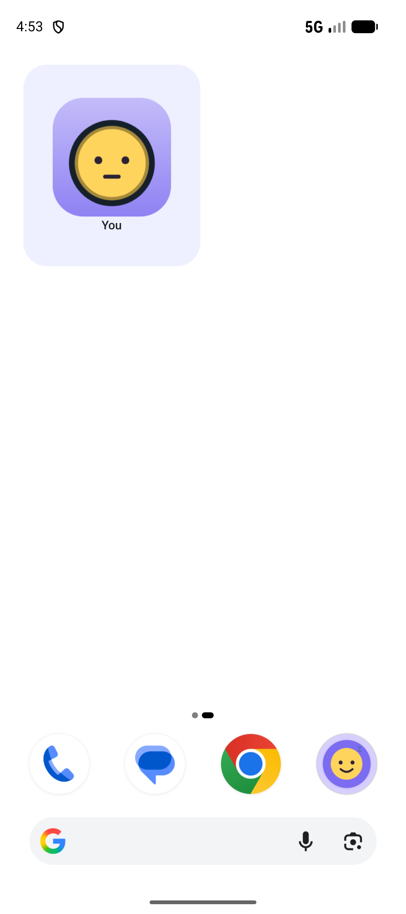
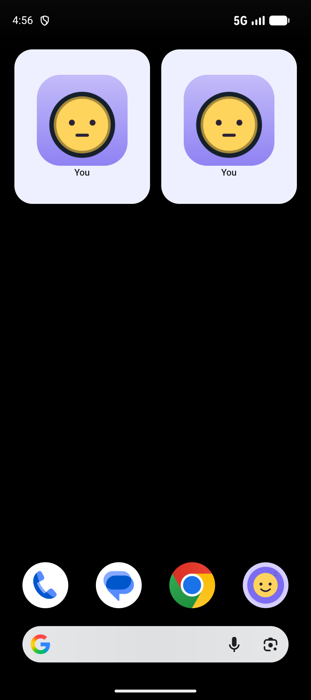

# Wallpaper contrast — checkpoint

Date: 2026-10-04. Branch: `widget/wallpaper-contrast-f07` from `origin/main` (`5756cf5`).

## Acceptance

| Criterion | Status |
| --- | --- |
| Pure domain mapping from a dark-text hint to light wallpaper, otherwise dark | Met (`wallpaperContrastMode`) |
| Android reader uses `WallpaperManager.getWallpaperColors(FLAG_SYSTEM)` and `HINT_SUPPORTS_DARK_TEXT` | Met. `getColorHints()` is API 31, so API 26–30 return no hint |
| Null colors and the pre-hint APIs fall back to a dark wallpaper | Met |
| Setting Auto (default), Light, Dark. Light and Dark override Auto | Met, stored in the existing DataStore settings |
| Refresh on wallpaper change and on the setting change, without a poll | Met. `OnColorsChangedListener` while the process is alive; every widget render re-reads colors, including expiry and reconcile |
| Contrast mode is part of the render key | Met. Light and dark keys differ, including the widget bitmap key |
| Unit tests for hints, null colors, each setting, and the render key | Met (`WallpaperContrastTest`, 6 tests) |
| Roborazzi snapshot per mode | Not added. F-14 is not on `origin/main`. Device screenshots are the visual check |
| Launcher screenshots, light and dark wallpaper | Met |

## What changed

Widget renders no longer hard-code `WallpaperContrastMode.DARK_WALLPAPER`. `SystemWallpaperContrast` reads the system wallpaper and the user's setting, and `wallpaperContrastMode` in `domain/avatar` decides the mode. Auto maps `HINT_SUPPORTS_DARK_TEXT` to a light wallpaper (dark outline). A missing hint, null colors, or API 26–30 map to a dark wallpaper (light outline).

Settings has Auto, Light, and Dark. Choosing one writes DataStore and refreshes widgets. `AppContainer.start()` registers `WallpaperManager.OnColorsChangedListener` for the system wallpaper. Expiry and reconcile already call `widgets.all()`, and each render reads the wallpaper again. `updatePeriodMillis` stays 0.

`AvatarResolver.renderKey` already included `wallpaperContrastMode`. The widget bitmap key is `RenderCache.keyOf("${resolved.renderKey}|256")`, so a light-wallpaper bitmap is not reused for a dark wallpaper.

## Screenshots

Pixel_9 AVD, emulator-5554. White wallpaper, then black. The white wallpaper uses a dark outline. The black wallpaper uses a light outline. The second page shows two self widgets because the pin was repeated while checking the launcher.





## Files

Changed:

- `app/src/main/java/app/idl/AppContainer.kt`
- `app/src/main/java/app/idl/data/local/AppSettings.kt`
- `app/src/main/java/app/idl/ui/settings/SettingsScreen.kt`
- `app/src/main/java/app/idl/widget/Widgets.kt`
- `app/src/main/java/app/idl/work/Workers.kt`
- `docs/IDL_WIDGET_ARCHITECTURE.md`
- `master-plan.md`

Created:

- `app/src/main/java/app/idl/domain/avatar/WallpaperContrast.kt`
- `app/src/main/java/app/idl/widget/SystemWallpaperContrast.kt`
- `app/src/test/java/app/idl/domain/avatar/WallpaperContrastTest.kt`
- `docs/handoff/reports/2026-10-04-wallpaper-contrast-f07.md`
- `docs/handoff/reports/screenshots/widget-light-wallpaper.png`
- `docs/handoff/reports/screenshots/widget-dark-wallpaper.png`

## Commands

```
scripts/check.sh
```

From Git Bash. Unit tests, lint, and the debug build. Device tests were not part of this check. The launcher check was manual on emulator-5554.

- JVM: 167 tests, 0 failed, 1 skipped
- lint: 0 errors, 39 warnings
- All checks passed

## Deviations

- `WallpaperColors.getColorHints()` and `HINT_SUPPORTS_DARK_TEXT` are API 31, not API 27. `getWallpaperColors(FLAG_SYSTEM)` is API 27, and the color-change listener is API 27. On API 26–30 Auto uses a dark wallpaper. Light and Dark still override that.
- Roborazzi snapshots were not added. F-14 is on `test/roborazzi-f14` (PR #11) and is not on `origin/main`. This branch has no snapshot tests, and `scripts/check.sh` does not run `verifyRoborazziDebug`.
- `scripts/check.sh --device` was not run. The task asked for `scripts/check.sh` plus launcher screenshots.

## Known limitations

- The wallpaper listener is registered for the life of the process and is not removed. The process is the listener's lifetime.
- If the process is dead when the wallpaper changes, the next expiry or reconcile render reads the new colors. There is no poll in between.
- A SecurityException or other runtime failure from `getWallpaperColors` is treated as no colors, so Auto uses a dark wallpaper.

## Commits

```
820cb81 Match widget outline contrast to the wallpaper.
```

PR #16.
