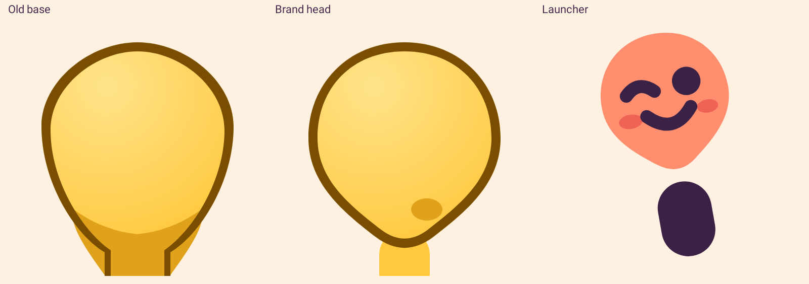
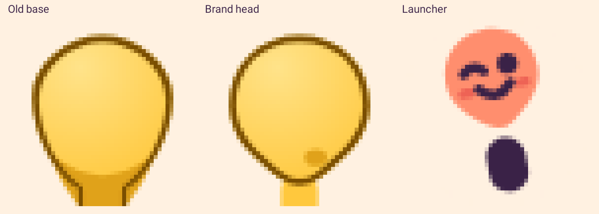
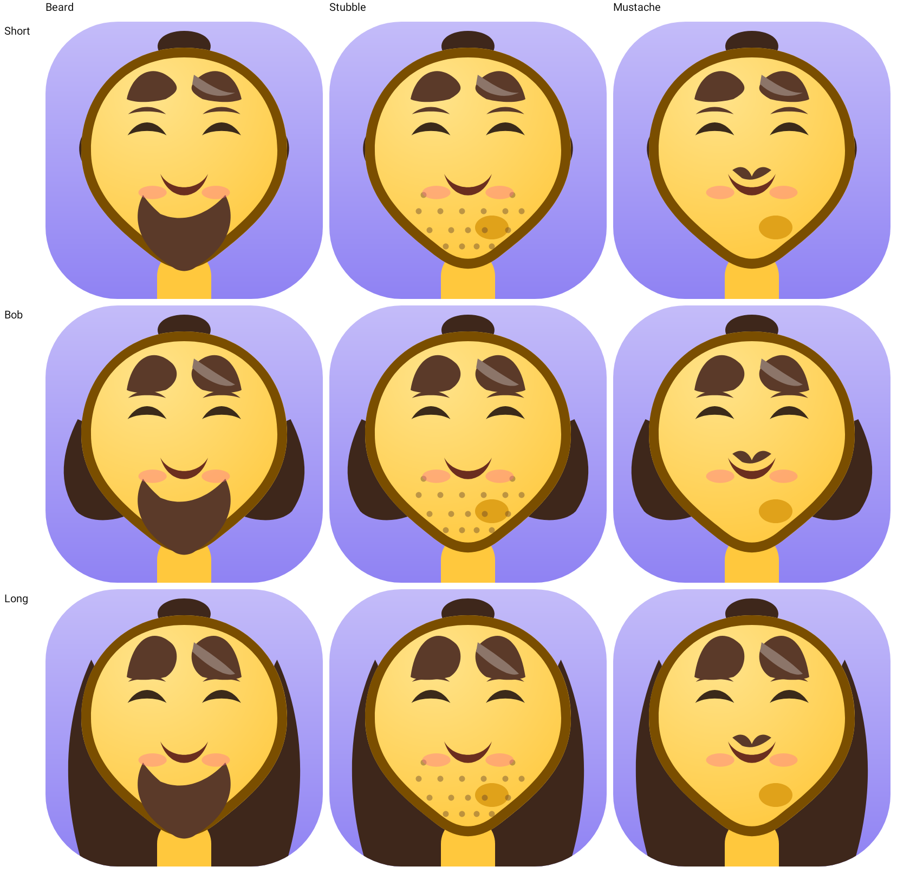
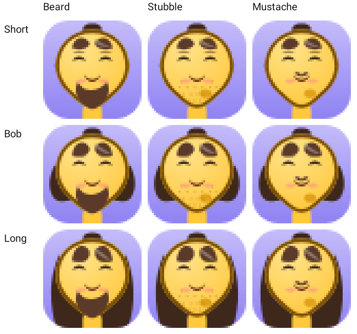

# 2026-10-06 — AP-1 brand silhouette is the avatar head

Branch `avatar/ap-1-brand-silhouette` from `origin/main` (`362ff36`). Spec: `docs/avatar/AVATAR_PROGRAM.md` §6 AP-1. One PR.

## Acceptance

| Criterion | Result |
| --- | --- |
| Shared silhouette file | Met. `config/teardrop_silhouette.json` holds the 108-unit brand path and the map x' = 512 + (x − 54) · 760/54, y' = 96 + (y − 26) · 760/54. |
| Brand generator reads that file | Met. `docs/art/brand/gen_brand.py` loads `TEARDROP` from the file. Rerunning it left every brand output byte-identical (`git diff` showed only the script and the README). |
| Face is the mapped path, generated | Met. `tools/gen_teardrop_base.py` writes `base_teardrop` from the config. The face commands are the mapped path. The neck column is gone from the face. |
| Outline | Met. Even-odd ring, Tiller-Hanson offset inward 36 units. Sampled distance from the inner ring to the face is 33.4–36.8. |
| Temporary neck | Met. Part `neck` on band 40, before the face. Apex y 840, width 200. Chin bottom y 912, so the top is 72 units inside the chin. |
| Anchors and features | Met. Eye line y 420, mouth y 580. Eyes, brows, mouths, glasses, bob, long hair, beard, stubble, and mustache were refit. `contentVersion` bumped on each changed picture. |
| Geometry docs | Met. `docs/ASSET_SPEC.md` records the map and measured spans. Master-plan §5 D-45 lists the 1024-grid numbers. |
| Deviation test | Met. `TeardropSilhouetteTest` samples 250 points on the canonical path and on the face. Maximum deviation is under 2. Neck width stays ≤ 240, and at 20 units below the apex the neck is ≥ 20 inside the silhouette. |
| Side-by-side at 512 and 48 | Met. Old base, new base, and the launcher mark. |
| Procedural widget goldens | Met. No file under `app/src/test/snapshots/widget/` changed. |
| `check` and `--device` | Met. See commands. |









## Commands

```
scripts/check.ps1
```

On `a07cf58` (before the device-test one-liner and this report): **234 tests, 0 failed, 1 skipped**. Lint **0 errors, 42 warnings**.

Vector goldens were recorded with:

```
./gradlew recordRoborazziDebug --tests app.idl.avatar.VectorSliceSnapshotTest --tests app.idl.avatar.TeardropCompareSnapshotTest
```

Procedural widget goldens were not recorded.

```
$env:ANDROID_SERIAL = "emulator-5554"
scripts/check.ps1 -Device
```

**234 tests, 0 failed, 1 skipped**. Lint **0 errors, 42 warnings**. Instrumented tests: **21 tests, 0 failed**, on `emulator-5554` (Pixel_9 AVD). The first device run failed one test; the fix is below. The second run is the one that passed.

`scripts/check.ps1` is the Windows entry for `scripts/check.sh`. Bash on PATH here is the Windows store stub, so the PowerShell script was used. SQL was not required.

## Files

- `config/teardrop_silhouette.json`
- `docs/art/brand/gen_brand.py`, `docs/art/brand/README.md`
- `tools/teardrop_geometry.py`, `tools/gen_teardrop_base.py`
- `app/src/main/assets/packs/emoji_core/v2/` (base, features, manifest anchors and content versions)
- `app/src/test/java/app/idl/domain/avatar/TeardropSilhouetteTest.kt`
- `app/src/test/java/app/idl/domain/avatar/AssetPackTest.kt`
- `app/src/test/java/app/idl/avatar/TeardropCompareSnapshotTest.kt`
- `app/src/androidTest/java/app/idl/avatar/VectorSliceDeviceTest.kt`
- `app/src/test/snapshots/vector/` including `ap1_compare_48.png`, `ap1_compare_512.png`, and `contact_*.png`
- `docs/ASSET_SPEC.md`, `docs/ARCHITECTURE.md`, `docs/avatar/AVATAR_PROGRAM.md`, `master-plan.md`

## Changed goldens

Procedural files under `app/src/test/snapshots/widget/` did not change.

Every file below changed because the head is now the brand teardrop and the features were refit onto it. The two `ap1_compare_*` files are new.

- `vector/ap1_compare_512.png`, `vector/ap1_compare_48.png` — old base, new base, launcher.
- `vector/contact_48.png`, `vector/contact_512.png` — hair × facial hair on the new head.
- `vector/{neutral,happy,short,hair,long,beard,stubble,mustache,glasses,scene,busy}_{48,128,512}.png` — slice recipes.
- `vector/widget/{neutral,happy,short,hair,long,beard,stubble,mustache,glasses,scene,busy}_{compact,standard}.png` — the same recipes through the widget targets.

## Deviations and choices

- The shade is a cheek ellipse (`face.shadow`), not a wash along the chin. On this silhouette the chin is narrow, and a wash that follows it sits under the 36-unit outline and reads as a nick. The ellipse stays about 50 units inside the outline. It shows at 48 px as a small darker spot on the right cheek.
- `hair_short_crop` was not redrawn. From the crown through the eye line the new outline is within about 7 units of the old one, and the existing cap and sideburns still hug it. Its `contentVersion` stays 1.
- The spec's reference widths are rounded. Measured spans, from sampling the mapped path: y 430 → 135–890, y 600 → 156–868, y 700 → 215–810, y 800 → 313–711, y 870 → 399–625. Chin bottom is y 912.3. These are the numbers in `docs/ASSET_SPEC.md`.
- The neck is temporary, on band 40, until AP-3 adds the body. It uses `face.primary` so the stub below the chin matches the face.
- `VectorSliceDeviceTest` asked for `contentVersion` 2 and expected a cache miss. That version is now the real base, so the assertion uses `contentVersion + 1`. The cache behavior is unchanged.
- `svg_face` in `gen_brand.py` still has its own path string. It matches the config, and regenerating the brand files did not change a byte. The vector drawables take `TEARDROP` from the file.

## Known limitations

- The neck is a stub, not the AP-3 body. Shoulders and the default shirt are not in this change.
- The cheek shade is one ellipse. A broader shade can come back when the body and a wider chin region exist.
- Other expressions still use procedural parts. Only neutral and happy are vector overrides.

## Commits

```
ac030f8 Share the brand teardrop path so the avatar head can match it.
a07cf58 Match the avatar head to the brand teardrop so every face shares one silhouette.
821c8b0 Record the AP-1 checkpoint and mark the brand silhouette done.
```
